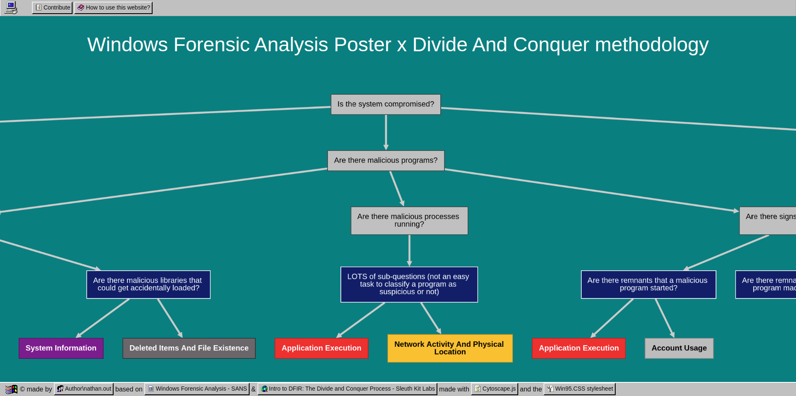

# Windows-DFIR-Artifact-Explorer

"Windows DFIR Artifact Explorer" website source code.

*Screenshot of the website.*

[https://windows-dfir-artifact-explorer.com/](https://windows-dfir-artifact-explorer.com/)

## Description

This site aims to compile two very useful resources for the Digital Forensic and Incident Response (DFIR) analyst:

- [Windows Forensic Analysis Poster - SANS](https://www.sans.org/posters/windows-forensic-analysis/)
- [Intro to DFIR: The Divide and Conquer Process - Sleuth Kit Labs](https://training.sleuthkitlabs.com/courses/intro-to-divide-and-conquer)

These provide the analyst with a **thought path*, as well as the **location**, **description** and **interpretation** of artifacts of interest. The associated tools are not yet available, but perhaps they will be in the next update?

**If you have any insights, ideas, or feedback to share, I encourage you to contribute. If something seems incomplete or if you've noticed any errors, don't hesitate to bring it to my attention.**

## Table of Contents

[The Divide And Conquer methodology](#the-divide-and-conquer-methodology)

[Windows Forensic Analysis Poster](#windows-forensic-analysis-poster)

[References](#references)

  [Documentary corpus](#documentary-corpus)
  
  [Tools](#tools)
  
  [Third party code](#third-party-code)
  
[Roadmap](#roadmap)

## The Divide And Conquer methodology

The idea behind this method created by *Sleuth Kit Labs* is to guide the novice analyst towards the artifacts of interest, depending on the case. To this end, the method proposes to divide questions into sub-questions until they can be answered by the analysis of one or more artifacts.

## Windows Forensic Analysis Poster

This invaluable poster created by The SANS Institute references and explains the most interesting Windows artifacts for a Digital Forensic and Incident Response (DFIR) analyst. The artifacts are grouped into categories with self-explanatory names such as “Application Execution, File And Folder Opening or Account Usage”. Each category contains several artifacts with descriptions, locations and interpretations.

## References

### Documentary corpus

- [Windows Forensic Analysis Poster - SANS](https://www.sans.org/posters/windows-forensic-analysis/)
- [Intro to DFIR: The Divide and Conquer Process - Sleuth Kit Labs](https://training.sleuthkitlabs.com/courses/intro-to-divide-and-conquer)
- [Malware memory analysis for non-specialists Investigating publicly available memory image for the Stuxnet worm - Defence Research and Development Canada](https://publications.gc.ca/collections/collection_2015/rddc-drdc/D68-2-1-2013-eng.pdf)
- [Malware memory analysis for non-specialists Investigating publicly available memory image for the Tigger Trojan horse - Defence Research and Development Canada](https://apps.dtic.mil/sti/tr/pdf/AD1004008.pdf)
- [Windows ::DATA Alternate Data Stream - OWASP](https://owasp.org/www-community/attacks/Windows_alternate_data_stream)
- [Master the Master File Table - Forsight](https://forsight.fr/static/media/mft.e01065cd365882356726.pdf)
- [Digital Forensics and Cyber Crime - Gyu-Sang Cho & Marcus K. Rogers](https://link.springer.com/chapter/10.1007/978-3-642-35515-8_18)
- [How the $LogFile works? - Msuhanov](https://dfir.ru/2019/02/16/how-the-logfile-works/)
- [Advanced $UsnJrnl Forensics - blueangel](http://forensicinsight.org/wp-content/uploads/2013/07/F-INSIGHT-Advanced-UsnJrnl-Forensics-English.pdf)
- [Attribute - $SECURITY_DESCRIPTOR (0x50) - NTFS Documentation](https://flatcap.github.io/linux-ntfs/ntfs/attributes/security_descriptor.html)
- [Digital Forensics - Plugx And Artifacts Left Behind - Count Upon Security](https://countuponsecurity.com/tag/ntfs-logfile/)
- [Operation Cobalt Kitty - Cybereason](https://cdn2.hubspot.net/hubfs/3354902/Cybereason%20Labs%20Analysis%20Operation%20Cobalt%20Kitty.pdf)
- [Follow the Link: Exploiting Symbolic Links with Ease - Cyberark](https://www.cyberark.com/resources/threat-research-blog/follow-the-link-exploiting-symbolic-links-with-ease)
- [Malware Reverse Engineering Handbook - NATO CCDCOE](https://ccdcoe.org/uploads/2020/07/Malware_Reverse_Engineering_Handbook.pdf)
- [ESE Databases are Dirty! by Chad Tilbury - SANS DFIR Blog](https://www.sans.org/blog/ese-databases-are-dirty/)

### Tools

- [Volatility3 releases page](https://github.com/volatilityfoundation/volatility3/releases)
- [MemProcFS](https://github.com/ufrisk/MemProcFS)

### Third party code

- [Cytoscape.js](https://js.cytoscape.org/)
- [Win95.CSS stylesheet](https://alexbsoft.github.io/win95.css/)

## Roadmap

- [ ] add og tags to share the website on social media
- [ ] improve intepretation section, as sometimes it is not properly formated (lists not displayed as lists...) (show example)
- [ ] add code formating css rules on path, GUID, etc... to improve lisibility (show example)
- [ ] break categories into uniques json files
